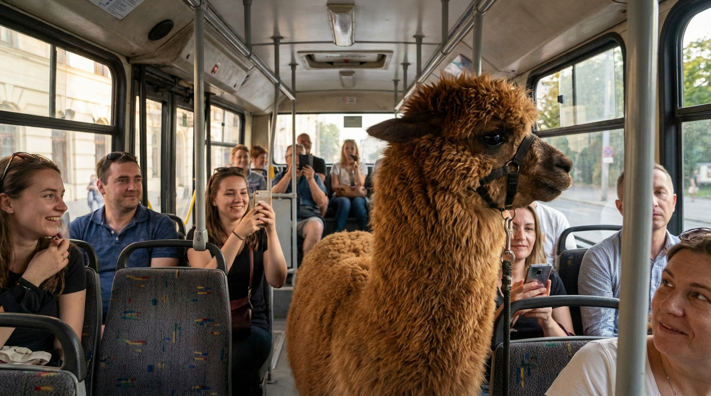
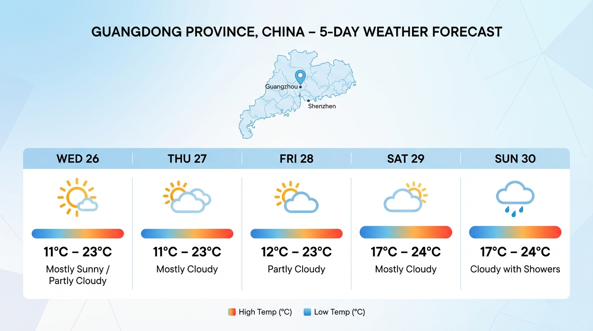

# Nano Banana Lab 🍌

[English](README.md) | [中文](README.zh-CN.md)

---

A learning project exploring Google Gemini 3 Pro Image (Nano Banana Pro) capabilities for AI image generation.

## Features & Experiments

| # | Experiment | File | Description | Status |
|---|------------|------|-------------|--------|
| 01 | Basic Generation | `experiments/01_basic.py` | Text-to-image generation with customizable aspect ratio | ✅ |
| 02 | Thinking Process | `experiments/02_thinking.py` | Visualize model's reasoning before image generation | ✅ |
| 03 | Search Grounding | `experiments/03_search.py` | Integrate real-time Google Search data into images | ✅ |
| 04 | 4K Generation | `experiments/04_4k.py` | Ultra-high resolution image generation (up to 4096x4096) | ✅ |
| 05 | Multilingual | `experiments/05_multilang.py` | Multi-turn chat for cross-language image translation | ✅ |
| 06 | Image Blending | `experiments/06_blend.py` | Combine multiple images with style transfer | ✅ |

## Streamlit Web UI

A full-featured web interface for interactive image generation.

```bash
# Run the web UI
streamlit run app.py
```

**Features:**
- 🌐 **Internationalization (i18n)** - English and Chinese support
- 🔑 **API Key Management** - Use environment variable or input your own key in UI
- 🎨 **Multiple Generation Modes:**
  - Basic Generation - Simple text-to-image
  - Chat & Refine - Iterative image improvement through conversation
  - Batch Generation - Generate multiple variations with progress tracking
  - Style Transfer - Apply artistic styles between images
  - Search Grounding - Generate images with real-time search data
  - Templates - Start with curated prompt templates
- 📊 **Cost Estimation** - See estimated costs before batch generation
- 📦 **ZIP Download** - Download all batch images in one file
- 📜 **History** - View and download previously generated images


## Function Details

### 01_basic.py - Basic Image Generation
```python
generate_basic_image(prompt, aspect_ratio="16:9")
```
- Generate images from text prompts
- Supports various aspect ratios: `16:9`, `1:1`, `9:16`, etc.
- Output: `outputs/01_basic.png`

### 02_thinking.py - Thinking Process Visualization
```python
generate_with_thinking(prompt, aspect_ratio="16:9")
```
- Enable model's thinking feature with `ThinkingConfig(include_thoughts=True)`
- Display model's reasoning process before image generation
- Output: `outputs/02_thinking.png`

### 03_search.py - Search Grounding
```python
generate_with_search(prompt, aspect_ratio="16:9")
```
- Integrate real-time Google Search data using `tools=[{"google_search": {}}]`
- Generate images with up-to-date information (weather, news, etc.)
- Output: `outputs/03_search.png`

### 04_4k.py - 4K Ultra HD Generation
```python
generate_4k_image(prompt, resolution="4K", aspect_ratio="16:9")
```
- Support multiple resolutions: `1K`, `2K`, `4K`
- 4K generates 4096x4096 images
- Output: `outputs/04_4K.png`

### 05_multilang.py - Multilingual Capabilities
```python
generate_multilingual_image(prompt, aspect_ratio="16:9", filename="05_multilang.png")
chat_and_translate()
```
- Multi-turn conversation mode for image translation
- Maintain visual consistency across languages
- Output: `outputs/05_multilang_en.png`, `outputs/05_multilang_zh.png`

### 06_blend.py - Advanced Image Blending
```python
blend_images(prompt, image_paths, aspect_ratio="16:9")
demo_style_transfer()
```
- Blend up to 14 images (Pro model)
- Style transfer capabilities
- Output: `outputs/06_base_photo.png`, `outputs/06_style_ref.png`, `outputs/06_blend.png`

## Quick Start

### 1. Environment Setup

```bash
# Create virtual environment
python -m venv venv
source venv/bin/activate  # Windows: venv\Scripts\activate

# Install dependencies
pip install -r requirements.txt
```

### 2. Configure API Key

```bash
# Copy environment template
cp .env.example .env

# Edit .env file and add your API Key
# Get it from: https://aistudio.google.com/app/apikey
```

### 3. Run Experiments

```bash
# Run basic generation experiment
python experiments/01_basic.py

# Generated images are saved in outputs/ directory
```

## Output Gallery

### 01 - Basic Generation

*A cute corgi wearing sunglasses on a beach at sunset - photorealistic style*

### 02 - Thinking Process

*Viral-worthy image generated with visible AI reasoning process - a dog working at a desk*

### 03 - Search Grounding

*Real-time weather forecast for Guangdong Province, China - 5-day forecast visualization*

### 04 - 4K Ultra HD

*Four seasons of an oak tree - 4096x4096 ultra-high resolution image*

### 05 - Multilingual (English)

*Coffee journey infographic - English version*

### 05 - Multilingual (Chinese)

*Coffee journey infographic - Chinese version (same layout, translated content)*

### 06 - Image Blending

| Base Photo | Style Reference | Blended Result |
|------------|-----------------|----------------|
|  |  |  |
| *Cat on windowsill* | *Abstract watercolor* | *Watercolor style cat* |


## Project Structure

```
nano-banana-lab/
├── .env.example        # Environment template
├── .env                # Your API Key (do not commit)
├── requirements.txt    # Python dependencies
├── config.py           # Client initialization & timing instrumentation
├── app.py              # Streamlit Web UI entry point
├── components/         # UI components
│   ├── sidebar.py      # Settings & API key management
│   ├── basic.py        # Basic generation mode
│   ├── chat.py         # Chat & refine mode
│   ├── batch.py        # Batch generation mode
│   ├── blend.py        # Style transfer mode
│   ├── search.py       # Search grounding mode
│   ├── templates.py    # Prompt templates mode
│   └── history.py      # Generation history
├── services/           # Backend services
│   ├── generator.py    # Async image generator
│   └── chat_session.py # Chat session manager
├── i18n/               # Internationalization
│   ├── en.json         # English translations
│   └── zh.json         # Chinese translations
├── experiments/        # Experiment scripts
│   ├── 01_basic.py     # Basic text-to-image
│   ├── 02_thinking.py  # Thinking process visualization
│   ├── 03_search.py    # Search-grounded generation
│   ├── 04_4k.py        # High-resolution generation
│   ├── 05_multilang.py # Multilingual support
│   └── 06_blend.py     # Image blending & style transfer
├── outputs/            # Generated images
├── Dockerfile          # Docker configuration
├── docker-compose.yml  # Docker Compose config
└── README.md
```

## Pricing Reference

| Resolution | Price per Image | Notes |
|------------|-----------------|-------|
| 1K / 2K | $0.134 | Standard quality |
| 4K | $0.24 | Print-quality |
| Batch API | -50% | Use for bulk generation |

## References

- [Official Documentation](https://ai.google.dev/gemini-api/docs)
- [Google AI Studio](https://aistudio.google.com)
- [Pricing Page](https://ai.google.dev/pricing)
